(Almost) all you need to know about how to create a scrollytelling document for a concept map!  To get started, you'll first need to install a few things, and in a particular order (conveniently, as they appear below).  You'll download R, RStudio, and Quarto from the stated websites; all of these are free and open-source.  As a last step,  you have to tell RStudio how to use closeread, the extension that will let you create a Scrollytelling document.  We will get to that later, though, after we've opened RStudio and started a project.

You'll only ever have to do these 'download things' steps once on any given machine - once it's downloaded, it's there!  

## R

:::{.cr-section}

First, we will install R by visiting <https://cran.rstudio.com/>. Even though we won't use R directly, we still need it before we can install other user interfaces! @cr-Rinstall1


:::{#cr-Rinstall1}

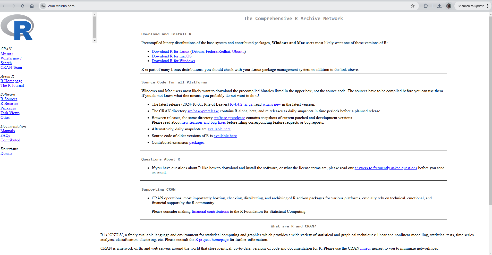
:::

At the top of this page is a series of download links: Mac, Windows, and Linux options. You'll pick the one that best describes your computer, and follow the directions at the appropriate link. @cr-Rinstall2

:::{#cr-Rinstall2}

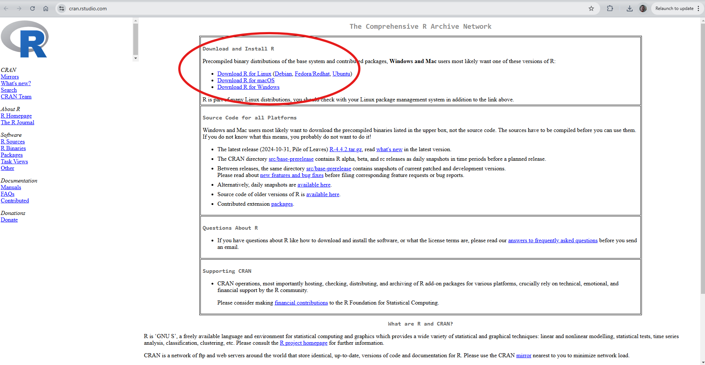
:::

:::

Now that R is installed, time to install RStudio.

## RStudio

:::{.cr-section}

To install RStudio, a user-friendly interface for R, you will go to this link: <https://posit.co/download/rstudio-desktop/>.  You'll notice that you'll be prompted to first install R (which we've already done!) before installing RStudio. RStudio will be used to create the project to house the Scrollytelling document, using Quarto (to be installed next). @cr-rsinstall

If you have a windows machine,  you can go to the big blue button ("DOWNLOAD RSTUDIO DESKTOP FOR WINDOWS") [@cr-rsinstall]{pan-to="-50%,-55%" scale-by="2"}

If you do not have a windows machine, if you scroll down a bit, you'll see a list of options for different operating systems.  Just pick the one that best fits your situation, and follow the directions for installing on your machine. @cr-rsinstall2

The RStudio icon is what you will click to start a new project, so put it somewhere that you can find it again.  We will not be using the R icon, so if you don't remember where that is, it's okay.

:::{#cr-rsinstall}

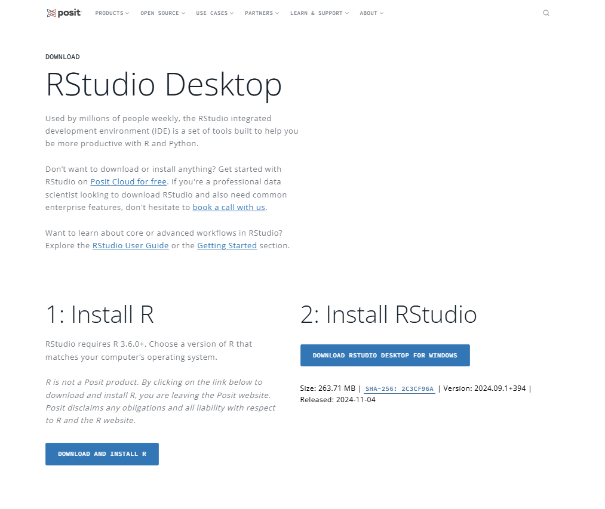
:::

:::{#cr-rsinstall2}
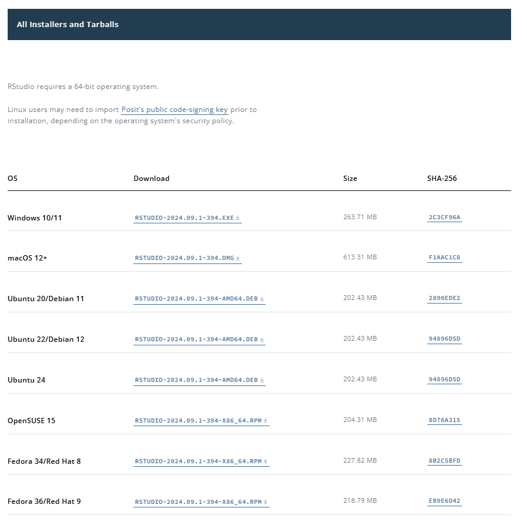
:::

:::

## Quarto

:::{.cr-section}
Quarto is a publishing system that allows for integration of a number of different programming and visualization languages (e.g. R, Python, GraphViz, etc.) as well as narrative.  As an added flexibility, Quarto documents can be rendered in a wide variety of formats, from websites and books to PDF and HTML.  We will be making use of the html rendering capability for our Scrollytelling document. To download Quarto, you will visit <https://quarto.org/docs/download/>.  @cr-Qinstall

As with RStudio, if you have a Windows machine, there's a big blue button for you to install Quarto on your machine. [@cr-Qinstall]{pan-to="75%,75%" scale-by="3"}

If you don't have a Windows machine, you'll again select the appropriate operating system from the list provided. @cr-Qinstall

The Mac option is hidden a bit further down this list than it was for RStudio.  It is there, though!  @cr-Qinstall2

:::{#cr-Qinstall}
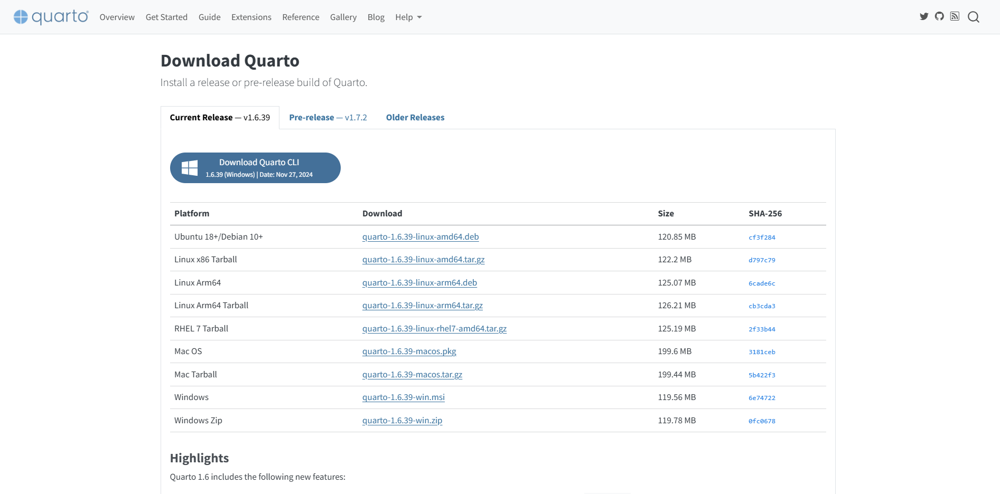
:::

:::{#cr-Qinstall2}

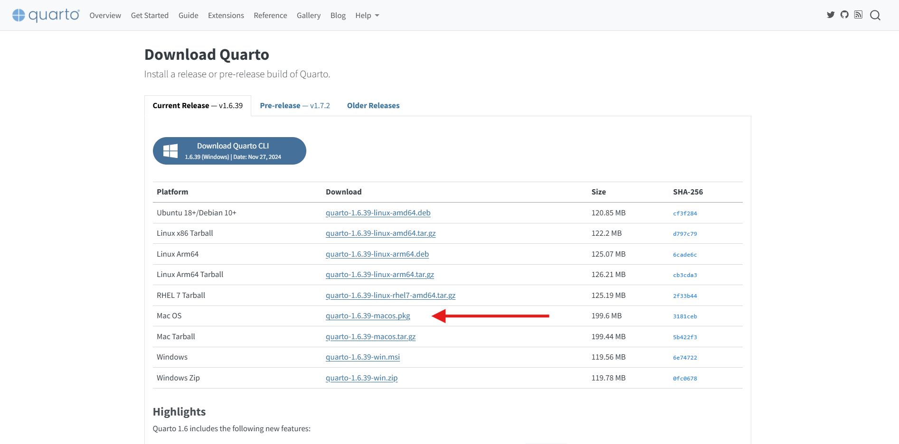

:::


:::

## Opening RStudio

:::{.cr-section}

To start our concept map, we will open up RStudio.  When we first open it up, we only see three of the four possible windows.  @cr-open

We need to open up a new Quarto project, which will let us keep all our files in one folder.  If we were to want to reference any pictures or files, having them all in the same project will make it easier.  It also becomes easier to share a project - you can just share the entire folder and know that it contains everything needed to reproduce your concept map. @cr-open2

Clicking the circled icon will open the menu to start a new project.  

Your first choice will be where you'd like to put this new folder.  @cr-open3

Choosing a new directory will allow you to choose where in your file structure you want a new folder created.  We will choose this option for now. 

Our next step is to select what type of project we want to create. @cr-open4

We will choose 'Quarto Project' for our concept map project. @cr-open5

Once we have selected our project type, we then get to say where we want this folder to live on our computer @cr-open6

Clicking 'Browse' will open your file directory and allow you to select where to put the folder. @cr-open6a

I prefer to uncheck the box for 'Visual Editor', but this is entirely up to personal preference. @cr-open6b

The last step is to name the folder. @cr-open7

I am choosing to name this one 'Example'. @cr-open7a

After we click 'Create Project', our new Quarto project will open up. @cr-open8

At this point, we are ready to start!

:::{#cr-open}

:::

:::{#cr-open2}
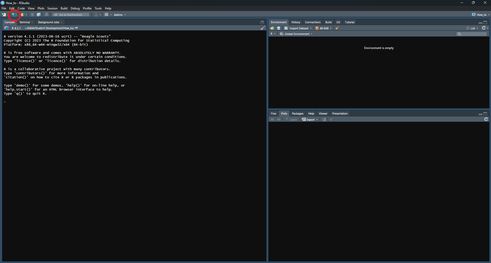
:::

:::{#cr-open3}
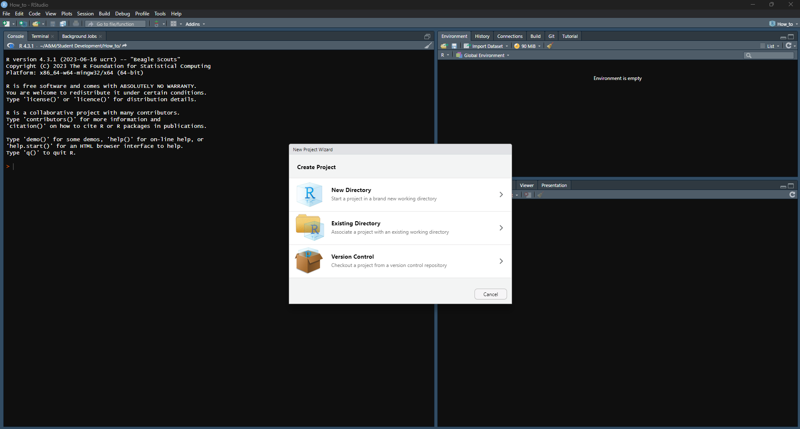
:::

:::{#cr-open4}
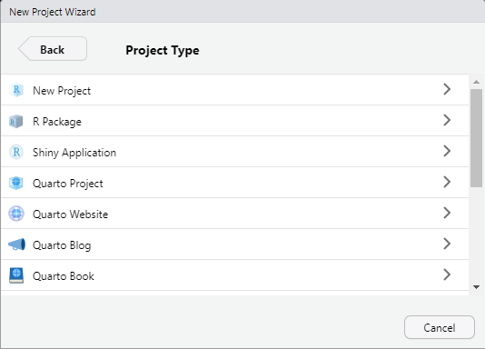
:::

:::{#cr-open5}
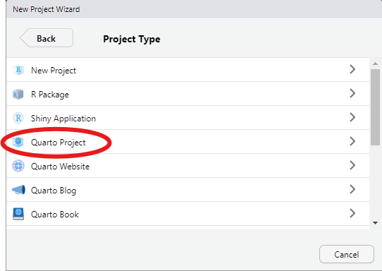
:::

:::{#cr-open6}
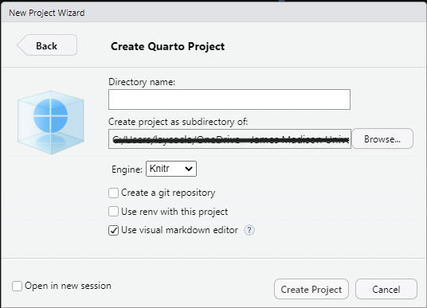
:::

:::{#cr-open6a}
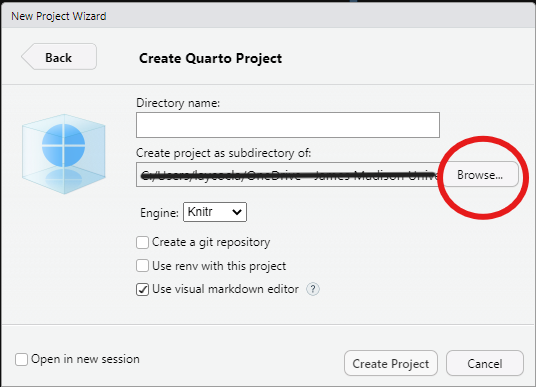
:::

:::{#cr-open6b}
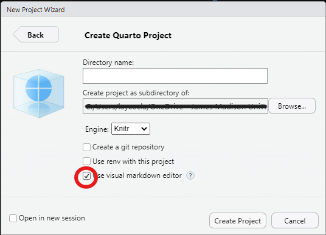
:::

:::{#cr-open7}
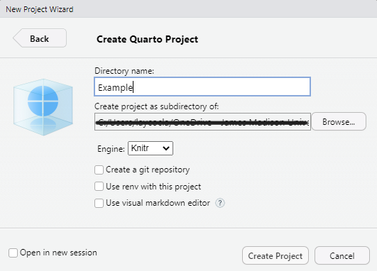
:::

:::{#cr-open7a}
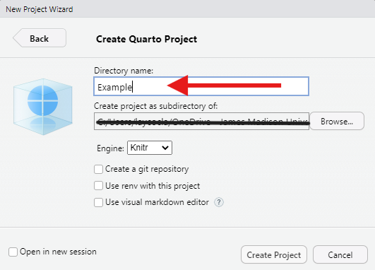
:::

:::{#cr-open8}
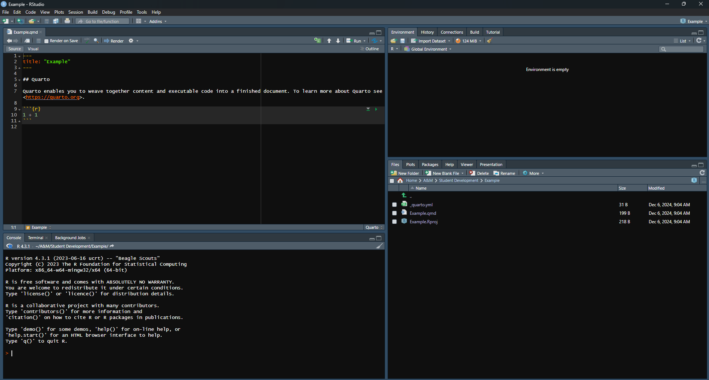
:::

:::


## Closeread Authorization

:::{.cr-section}

In order to create a scrollytelling document, we need to first state that we are doing a Closeread document. Going to the 'Terminal' Tab of our RStudio window (lower left hand quadrant), we will type in "quarto add qmd-lab/closeread" and hit enter. @cr-CRauth1 

It will ask us if we trust the authors of the extension.  Since we do, we will type "Y" and hit enter again. @cr-CRauth2

Then, it tells us what modifications will be made, and asks if we wish to proceed.  We do, so we will type "Y" again and hit enter. @cr-CRauth3

Once it's done, it will ask if we want to view the documentation.  If you'd like to view the documentation, type "Y" and hit enter, and it will open up in your default browser.  If you're not interested in viewing the documentation at this time, simply type "n" and hit enter, and you can proceed to building your document.

:::{#cr-CRauth1}
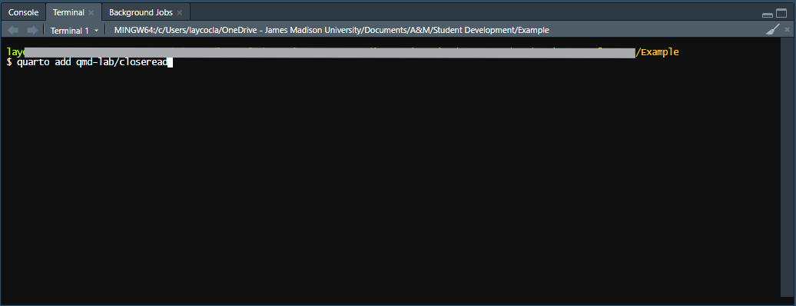
:::

:::{#cr-CRauth2}
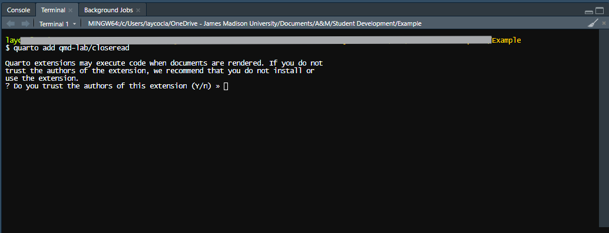
:::

:::{#cr-CRauth3}
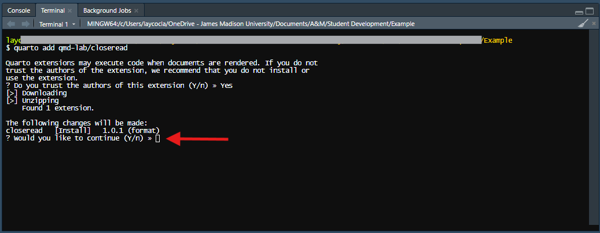
:::

:::{#cr-CRauth4}
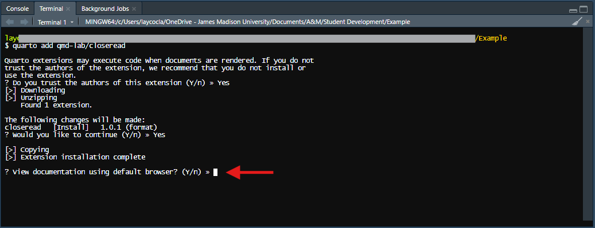
:::

:::

## Header

One last task before we can get to making our concept map is to modify the header of our document.  If you look at the main window (upper right hand side) that opened up when you started your quarto project, you'll see a header that looks like this:

```
---
title: "Example"
---
```

We need to modify that to again let R know what type of document we are doing.  Modify your header to add the lines you see below (and please feel free to change the title!) 

```
---
title: "Example"
format:
  closeread-html:
    cr-style:
      narrative-background-color-overlay: white
      section-background-color: white

---
```

Other than that header, you can delete everything else that was helpfully auto-populated in you document.


## Making the Concept Map

Now!  On to our concept map-making.

First, we need to make a concept map to bring in to our scrollytelling document.  I find it easier to draw it out on paper first, then transfer it to code, but it can go however your brain works best.  I have the code for a sample concept map worked out below - we will go through this and discuss what the different parts are.

:::{.cr-section}

To start, we need to initialize a 'code block' in our Quarto document.  This is telling Quarto that we'd like it to run the stated code as well as what language that code is in.  Our concept map will be using something called 'GraphViz', so we will use the '{dot}' extension.  It will look like this: @cr-conceptmap1


:::{#cr-conceptmap1}

````
```{dot}
map goes here
```
````

:::

Now, let's look at a bit more detail, adding in the components of a concept map. @cr-conceptmap2

That code we just saw will create this concept map. @cr-conceptmap3

But, back to the code.  @cr-conceptmap2

These first lines are just some graph set-up bits.[@cr-conceptmap2]{highlight="1-12"}

These specifically are addressing the shape of the bubbles of the concept map.  We've got them set to be ovals, allow them to be filled, and have set the font and font size. [@cr-conceptmap2]{highlight="2-8"}

Then, we are giving some information about our overall graph.  Since this is a concept map, we want it to be built out from the center (hence, root!), and we'd really rather the ovals not overlap. [@cr-conceptmap2]{highlight="9-12"}

Now, we start building our concept map.  Note, that to build the map, I like to just use letters or abbreviations.  We will go back later to specify what text and/or colors we want these bubbles to be. [@cr-conceptmap2]{highlight="14-23"}

I like to start with the center, and list all the "1st level" thoughts (Called 'Branch' in the graph) I want mapped to it.  On this line, we are doing just that.  Since I have multiple "1st level" thoughts, I grouped them within curly brackets. [@cr-conceptmap2]{highlight="14"}

Then, we can add on our next layer.  Maybe these first level thoughts have spawned other thoughts.  That's what we are doing with these lines.  In this example, I have each first level thought mapping to one or more second level thoughts, but that is totally optional.  Maybe thought "a" started and ended there - we don't have to map further if it didn't make sense to do so. [@cr-conceptmap2]{highlight="16-20"}

And then finally, I have one last layer building out a thought further. You might have more, or none. Whatever makes sense for your map.  You may also have further layers built out - just keep following the pattern we've established to complete your map. [@cr-conceptmap2]{highlight="22"}

After the skeleton of our map has been built out, we need to add labels (and colors, if desired).  This is what I am doing here.  [@cr-conceptmap2]{highlight="24-42"}

What we do is provide the abbreviation that we used to initially build our map (i.e., 'center', 'a', 'b2', etc.) and then open some square brackets.  Within those brackets, we can specify things such as labels, fillcolor, and fontcolor, among other things.  Perhaps the most important one is the label.  This will give the text that appears within each bubble.

Fillcolor and fontcolor are for aesthetic purposes - they allow you to customize the color used to fill the different bubbles, as well as to change the text color.  What I have done is use hex codes to specify colors.  I've used the [viridis color palette](https://rpubs.com/mjvoss/psc_viridis) to ensure accessibility, but you can use any hex codes, or even just color names ("blue", "purple", etc.). 

Once we're happy with our map, we can verify how it looks, and then move on to making it a scrollytelling document. @cr-conceptmap3


:::{#cr-conceptmap2}

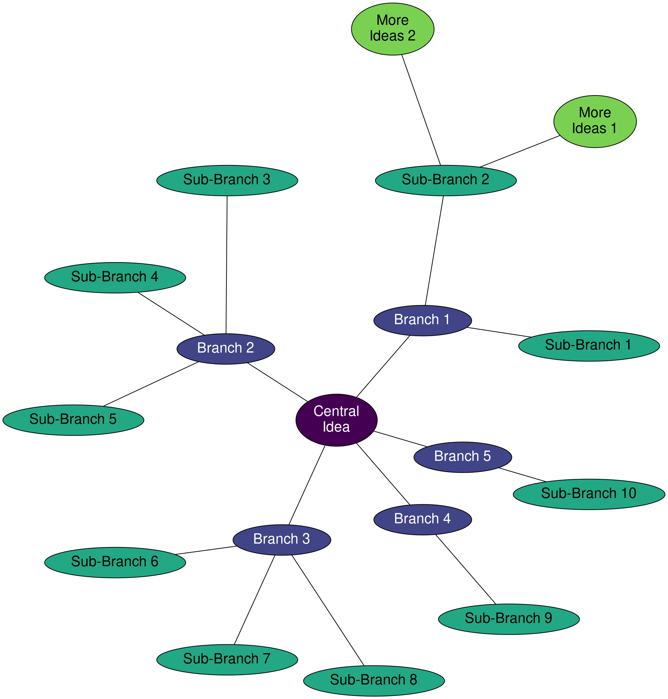


:::


:::{#cr-conceptmap3}

```{dot}
graph A {
node [
		shape = oval
		style = filled
		fontname="Helvetica,Arial,sans-serif"
		fontsize = 20
	]
	layout = twopi
	root = "center"
	overlap = false 
	margin = 0

	center -- {a b c d e};
	
	a -- {a1 a2};
	b -- {b1 b2 b3};
	c -- {c1 c2 c3};
	d -- {d1};
	e -- {e1};
	
	a2 -- {aa1 aa2};

	center[label = "Central\nIdea" fillcolor = "#440154FF" fontcolor = white];
	a[label = "Branch 1" fillcolor = "#414487FF" fontcolor = white];
	b[label = "Branch 2" fillcolor = "#414487FF" fontcolor = white];
	c[label = "Branch 3" fillcolor = "#414487FF" fontcolor = white];
	d[label = "Branch 4" fillcolor = "#414487FF" fontcolor = white];
	e[label = "Branch 5" fillcolor = "#414487FF" fontcolor = white];
	a1[label = "Sub-Branch 1" fillcolor = "#22A884FF"];
	a2[label = "Sub-Branch 2" fillcolor = "#22A884FF"];
	b1[label = "Sub-Branch 3" fillcolor = "#22A884FF"];
	b2[label = "Sub-Branch 4" fillcolor = "#22A884FF"];
	b3[label = "Sub-Branch 5" fillcolor = "#22A884FF"];
	c1[label = "Sub-Branch 6" fillcolor = "#22A884FF"];
	c2[label = "Sub-Branch 7" fillcolor = "#22A884FF"];
	c3[label = "Sub-Branch 8" fillcolor = "#22A884FF"];
	d1[label = "Sub-Branch 9" fillcolor = "#22A884FF"];
	e1[label = "Sub-Branch 10" fillcolor = "#22A884FF"];
	aa1[label = "More\nIdeas 1" fillcolor = "#7AD151FF"];
	aa2[label = "More\nIdeas 2" fillcolor = "#7AD151FF"]; 

	
}
```


:::


:::

## Adding the Closeread Component

What we did above was generate the code needed to create the concept map.  We could just end there, and provide text below our map to give captioning.  That would not be considered a scrollytelling document, but it would get the point across just fine.  

:::{.cr-section}

To create the scrollytelling functionality, we need to add a few 'fences'. @cr-scrollymap1

The entire scrollytelling portion will be enclosed within `:::{.cr-section}` and `:::`.  

The `:::{#cr-myplot}` and then `:::` indicate the portion that we want to have 'stuck' while the other text scrolls by.  We would put our code to make our concept map within this portion, since we want the map to be the static portion.

:::{#cr-scrollymap1}
```markdown

:::{.cr-section}

:::{#cr-myplot}
<code, image, or text goes here>
:::

:::
```
:::

Applying this to our concept map, we would have something like this: @cr-scrollymap2

To preserve screen space, some of the labels have been removed, and replaced with "...".  Otherwise, everything would not fit neatly on the screen.

:::{#cr-scrollymap2}

````markdown
:::{.cr-section}

:::{#cr-myplot}
```{dot}
graph A {
node [
		shape = oval
		style = filled
		fontname="Helvetica,Arial,sans-serif"
		fontsize = 20
	]
	layout = twopi
	root = "center"
	overlap = false 
	margin = 0

	center -- {a b c d e};
	a -- {a1 a2};
	b -- {b1 b2 b3};
	c -- {c1 c2 c3};
	d -- {d1};
	e -- {e1};
	a2 -- {aa1 aa2};

	center[label = "Central\nIdea" fillcolor = "#440154FF" fontcolor = white];
	a[label = "Branch 1" fillcolor = "#414487FF" fontcolor = white];
	b[label = "Branch 2" fillcolor = "#414487FF" fontcolor = white];
	c[label = "Branch 3" fillcolor = "#414487FF" fontcolor = white];
	d[label = "Branch 4" fillcolor = "#414487FF" fontcolor = white];
	e[label = "Branch 5" fillcolor = "#414487FF" fontcolor = white];
...
	e1[label = "Sub-Branch 10" fillcolor = "#22A884FF"];
	aa1[label = "More\nIdeas 1" fillcolor = "#7AD151FF"];
	aa2[label = "More\nIdeas 2" fillcolor = "#7AD151FF"]; 
}
```

:::

:::
````

:::

:::

## Adding Text and Zooming

The last thing we need to add is the text that scrolls by, and some zooming to focus the attention on different portions of the concept map.

:::{.cr-section}

As a reminder, here is what we have for our map.  Here, I've left out the graph code to preserve space. @cr-zoom1

We add text in between the `{.cr-section}` fences, but outside the `{#cr-myplot}` fence.  This will make the text scroll by what we have designated as sticky (our concept map).  At the end of this first part of text is a call to our sticky object: `@cr-myplot`.  This will cause our concept map to show up on the screen.  Notice how this call matches the set of fences that designated our concept map as the sticky object. @cr-zoom2

Separating text by a line designates a new chunk to scroll by. We don't need to call the sticky object with each scrolling text.  However, if we want a new sticky object to come up, we would call it when we want it to show up.  For concept maps, we will probably stay on one map until we are done talking about it, then call the next one.  @cr-zoom3

Something else that is useful to do is to zoom in and/or shift the viewing plane of the sticky object.  With a concept map, we can zoom to different parts as we talk about them, making our meaning clearer.
@cr-zoom4

:::{#cr-zoom1}
````markdown
:::{.cr-section}

:::{#cr-myplot}
```{dot}
<graph code is here 

```

:::

:::
````
:::

:::{#cr-zoom2}
````markdown
:::{.cr-section}

Some text goes here. @cr-myplot

:::{#cr-myplot}
```{dot}
<graph code is here 

```

:::

:::
````
:::

:::{#cr-zoom3}
````markdown
:::{.cr-section}

Some text goes here. @cr-myplot

More text can go here. 
:::{#cr-myplot}
```{dot}
<graph code is here 

```

:::

:::
````
:::

The addition of `pan-to=` is moving the sticky object.  The first number tells by how much the sticky will pan up/down.  Positive numbers move it down while negative numbers move it up.  The second number is how much the sticky will pan left/right, with positive numbers moving it right and negative numbers moving it left.  Importantly, there is no space before or after the '='. [@cr-zoom4]{highlight="5"}

Then, `scale-by=` is the zoom - how much the sticky will be scaled up by.  Here, we are scaling it up by 1.5.

This process will take a minute to figure out what pan options will zoom to the right place on your concept map.  But once it's done, your scrollytelling document will zoom to the appropriate location on your concept map while your descriptive text scrolls by. @cr-zoom4


:::{#cr-zoom4}
````markdown
:::{.cr-section}

Some text goes here. @cr-myplot

More text can go here. We want to zoom here. [@cr-myplot]{pan-to="50%,50%" scale-by="1.5"}

Even more text. [@cr-myplot]{pan-to="-25%,80%" scale-by="2"}

:::{#cr-myplot}
```{dot}
<graph code is here 

```

:::

:::
````
:::

:::

## Final product

What it might look like with our example concept map if we add some pan and scaling might be this:

:::{.cr-section}

Here is my concept map. @cr-final

We can zoom here, and talk about this portion. [@cr-final]{pan-to="-25%,80%" scale-by="2"}

We can also look over here. [@cr-final]{pan-to="55%,-60%"}

And finally, we can talk about this part here. [@cr-final]{pan-to="30%,-20%" scale-by="3"}

:::{#cr-final}

```{dot}
graph A {
node [
		shape = oval
		style = filled
		fontname="Helvetica,Arial,sans-serif"
		fontsize = 20
	]
	layout = twopi
	root = "center"
	overlap = false 
	margin = 0

	center -- {a b c d e};
	
	a -- {a1 a2};
	b -- {b1 b2 b3};
	c -- {c1 c2 c3};
	d -- {d1};
	e -- {e1};
	
	a2 -- {aa1 aa2};

	center[label = "Central\nIdea" fillcolor = "#440154FF" fontcolor = white];
	a[label = "Branch 1" fillcolor = "#414487FF" fontcolor = white];
	b[label = "Branch 2" fillcolor = "#414487FF" fontcolor = white];
	c[label = "Branch 3" fillcolor = "#414487FF" fontcolor = white];
	d[label = "Branch 4" fillcolor = "#414487FF" fontcolor = white];
	e[label = "Branch 5" fillcolor = "#414487FF" fontcolor = white];
	a1[label = "Sub-Branch 1" fillcolor = "#22A884FF"];
	a2[label = "Sub-Branch 2" fillcolor = "#22A884FF"];
	b1[label = "Sub-Branch 3" fillcolor = "#22A884FF"];
	b2[label = "Sub-Branch 4" fillcolor = "#22A884FF"];
	b3[label = "Sub-Branch 5" fillcolor = "#22A884FF"];
	c1[label = "Sub-Branch 6" fillcolor = "#22A884FF"];
	c2[label = "Sub-Branch 7" fillcolor = "#22A884FF"];
	c3[label = "Sub-Branch 8" fillcolor = "#22A884FF"];
	d1[label = "Sub-Branch 9" fillcolor = "#22A884FF"];
	e1[label = "Sub-Branch 10" fillcolor = "#22A884FF"];
	aa1[label = "More\nIdeas 1" fillcolor = "#7AD151FF"];
	aa2[label = "More\nIdeas 2" fillcolor = "#7AD151FF"]; 

	
}
```

:::

:::

Congratualations!  You have made a scrollytelling document with a concept map!  You can now publish it to share with a wider audience.  Check out the links at [Quarto](https://quarto.org/docs/publishing/quarto-pub.html) to figure out the best method for you - there are many free options available.
